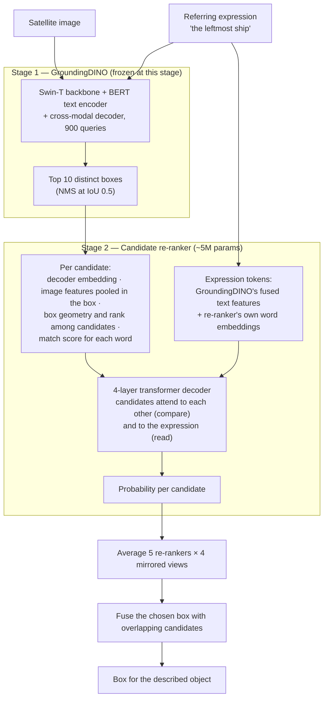
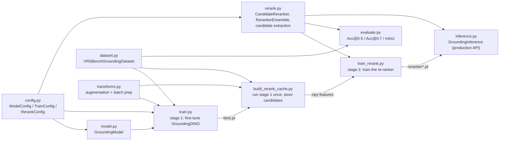
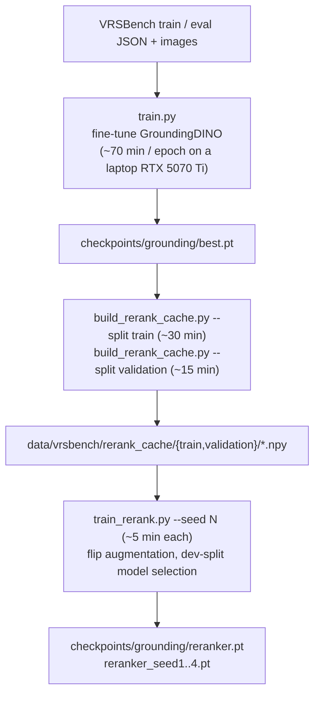
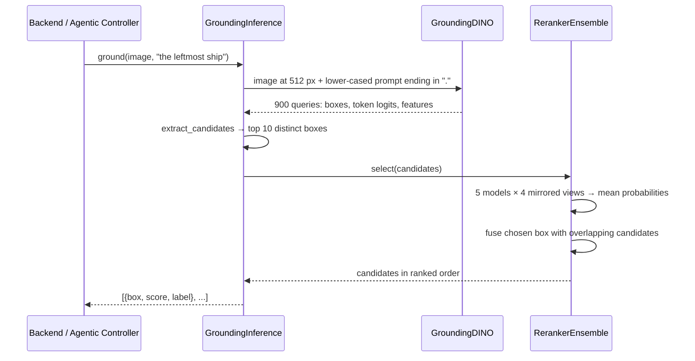

> Note: These diagrams use Mermaid code fences (` ```mermaid `). Obsidian renders these natively — no plugin needed, just paste this file in as-is.

# Text-Guided Region Grounding Module (`ml/grounding/`)

Given a satellite image and a plain-English description of one object (*"the leftmost ship"*, *"the small vehicle near the bottom-left corner on a grey path"*), this module returns the bounding box of that object.

It runs in **two stages**:

1. **GroundingDINO**, an open-vocabulary detector fine-tuned on VRSBench, proposes the 10 most likely boxes.
2. A small **candidate re-ranker** looks at all 10 together with the sentence and picks the one being described.

Dataset: **VRSBench** — ~36K training expressions and 16,146 evaluation expressions over ~29K remote-sensing images.

---

## Results

VRSBench evaluation set, all 16,146 expressions. **Acc@0.5** = share of expressions where the returned box overlaps the labelled box with IoU ≥ 0.5 (the benchmark's headline metric). "Unique" = the object is the only one of its class in the image; "non-unique" = the sentence has to single it out from look-alikes.

| Setup | Acc@0.5 | Acc@0.7 | mIoU | Unique | Non-unique |
|---|---|---|---|---|---|
| GroundingDINO alone (before) | 50.2% | 35.1% | 0.429 | 57.9% | 44.6% |
| + re-ranker v1 | 54.9% | 37.8% | 0.474 | 60.5% | 50.8% |
| + own word embeddings | 62.5% | 43.2% | 0.541 | 63.5% | 61.7% |
| + flip augmentation | 64.8% | 44.9% | 0.554 | 65.8% | 64.0% |
| **+ 5-model ensemble, test-time flips, box fusion (current)** | **67.5%** | **44.1%** | **0.557** | **69.8%** | **65.9%** |
| *Ceiling: best of the 10 candidates* | *85.2%* | *58.5%* | *0.692* | *85.7%* | *84.8%* |

For context, published VRSBench results: GeoChat 57.4%, RSGround-R1 63.7%, GeoGround 66.0%, GeoViS 68.5%, a 6-pipeline voting ensemble 79.3%, GeoSearcher (4B VLM + RL) 80.3% — the best we found. No published model reaches 90%.

The model is chosen on 5% of the **training** images held out as a dev set, so the evaluation set plays no part in any choice and these numbers are not inflated.

---

## 1. High-level architecture



### Why two stages

GroundingDINO scores each of its 900 candidate boxes against the text **on its own**. It never compares candidates, so it cannot resolve "the leftmost ship" or "the larger of the two tanks". Measured on the eval set:

| | Acc@0.5 |
|---|---|
| GroundingDINO's top-ranked box is correct | 50.2% |
| A correct box is among its top 10 | 85.2% |

The detector usually *finds* the object; it just ranks it wrong. Tuning GroundingDINO's hyperparameters (tried several times before this work) and training it longer (epoch 5 → 9: top-1 50.6% → 52.8%, top-10 unchanged at 85.1%) do not change that. The re-ranker attacks the ranking directly.

---

## 2. Module map — what each file does



| File | Purpose |
|---|---|
| `rerank.py` | `extract_candidates` (GroundingDINO output → top-10 candidate features), `CandidateReranker` (the model), `RerankerEnsemble` (averaging, test-time flips, box fusion), `mirror` / word-swap tables, loss |
| `build_rerank_cache.py` | Runs the fine-tuned GroundingDINO once over a split and saves every expression's candidates as `.npy` arrays in `data/vrsbench/rerank_cache/` |
| `train_rerank.py` | Trains a re-ranker on the cache (~5 min), picks the epoch on the dev split, prints the eval table |
| `evaluate.py` | `--reranker` runs the full two-stage pipeline live on images |
| `inference.py` | `from_checkpoint(..., reranker_path=...)` enables the second stage for the backend |

---

## 3. What the re-ranker sees

For each of the 10 candidates:

| Feature | Where it comes from | What it's for |
|---|---|---|
| Decoder embedding (256-d) | GroundingDINO's final query state | What the detector thinks the box contains |
| RoI image feature (256-d) | GroundingDINO encoder map (stride 8), pooled inside the box | Appearance: colour, texture |
| Geometry (17 values) | Box coordinates, size, aspect, distance to centre, detector score | Absolute position and size |
| **Rank among candidates** | Where the box falls left→right, top→bottom, small→large among the 10 | "leftmost", "largest", "second from top" |
| Word match scores | GroundingDINO's per-token logits for this box | Which words of the sentence this box matched |

And for the sentence:

| Feature | Why |
|---|---|
| GroundingDINO's fused text features | Object nouns, already aligned with the image |
| **The re-ranker's own trainable word embeddings** | GroundingDINO's frozen BERT features barely encode position words: the first re-ranker put "bottom left corner" at x = 0.76 and "right centre" at x = 0.16. Giving the re-ranker its own view of each word was the single biggest gain (+7.6 points). |

The transformer decoder lets each candidate attend to the other nine (to compare them) and to the sentence (to read it), then scores each candidate. Training uses cross-entropy toward the candidate that best overlaps the labelled box.

---

## 4. Inference-time improvements

All three live in `RerankerEnsemble` and are on by default.

| Technique | What it does | Gain (Acc@0.5) |
|---|---|---|
| **Ensemble** | Averages 5 re-rankers trained from different random seeds | +1.2 |
| **Test-time flips** | Also scores the image as if mirrored left↔right, top↔bottom and both — boxes flip and words swap ("left"↔"right", "top"↔"bottom", "upper"↔"lower", compass directions) — and averages the four | +0.1 to +0.4 |
| **Box fusion** | Averages the chosen box with any candidate overlapping it (IoU ≥ 0.3), weighted by probability | +1.3 |

Why fusion helps: 43% of the remaining wrong picks were **the right object with the wrong extent** — two candidates covering the same object at different sizes, and the re-ranker picked the one the labeller didn't draw. Averaging them usually lands closer to the label. The cost is slightly looser boxes (Acc@0.7 drops ~2 points); pass `--no-fuse` / `fuse_iou=None` if tight boxes matter more than hit rate.

---

## 5. Training pipeline



Commands (from the project root, in the `ml` environment):

```powershell
# Stage 1 (only if retraining the detector)
python -m ml.grounding.train

# Cache the detector's candidates — rerun whenever best.pt changes
python -m ml.grounding.build_rerank_cache --checkpoint checkpoints/grounding/best.pt --split train
python -m ml.grounding.build_rerank_cache --checkpoint checkpoints/grounding/best.pt --split validation

# Stage 2: five re-rankers for the ensemble
python -m ml.grounding.train_rerank --seed 0 --output checkpoints/grounding/reranker.pt
python -m ml.grounding.train_rerank --seed 1 --output checkpoints/grounding/reranker_seed1.pt
python -m ml.grounding.train_rerank --seed 2 --output checkpoints/grounding/reranker_seed2.pt
python -m ml.grounding.train_rerank --seed 3 --output checkpoints/grounding/reranker_seed3.pt
python -m ml.grounding.train_rerank --seed 4 --output checkpoints/grounding/reranker_seed4.pt

# Evaluate the full pipeline on images (~20 min for all 16,146 expressions)
python -m ml.grounding.evaluate --checkpoint checkpoints/grounding/best.pt --reranker "checkpoints/grounding/reranker*.pt"
```

The re-rankers are tied to the detector that produced their candidates: after retraining GroundingDINO, rebuild the caches and retrain the re-rankers.

### Training the detector on several GPUs (e.g. Kaggle 2× T4)

`train.py` supports multi-GPU training through PyTorch DDP: launch it with `torchrun`, one process per GPU. `--batch-size` is **per GPU**; the effective batch is `batch-size × grad-accum × GPUs`. Rank 0 alone downloads the data, evaluates, logs and saves checkpoints.

```bash
PYTHONUNBUFFERED=1 timeout --signal=INT 11h torchrun --nproc_per_node=2 -m ml.grounding.train \
    --epochs 20 --batch-size 4 --grad-accum 4 --num-workers 2 \
    --checkpoint-dir /kaggle/working/checkpoints/grounding \
    --resume <path to last.pt or final.pt>
```

- **Keep the effective batch when resuming.** The original run used batch 4 × grad-accum 8 on one GPU (32). On two GPUs, 4 × 4 × 2 gives the same 32 and the same number of optimizer steps per epoch, so the learning-rate schedule resumes in the right place.
- **Sessions:** Kaggle stops a session after 12 hours. `timeout 11h` ends training cleanly before that, and the next session resumes from the previous output's `last.pt`. Checkpoints now carry the training history and the best validation loss, so `history.json` and `best.pt` stay correct across sessions.
- **Precision:** T4s have no bf16, so training uses fp16 with loss scaling automatically; this was checked to train stably from the epoch-9 checkpoint.
- **Disk:** VRSBench needs ~25 GB with extraction, more than Kaggle's 20 GB `/kaggle/working`. Clone the repo to `/tmp` and point only `--checkpoint-dir` at `/kaggle/working`.

---

## 6. Inference flow (what runs in production)

```python
from ml.grounding.inference import GroundingInference

model = GroundingInference.from_checkpoint(
    "checkpoints/grounding/best.pt",
    reranker_path="checkpoints/grounding/reranker*.pt",   # glob, a path, or a list
)
model.ground("image.png", "the leftmost ship")
# [{"box": [x1, y1, x2, y2], "score": 0.71, "label": "the leftmost ship"}, ...]
```

The first entry is always the re-ranker's pick; further entries are other candidates it scores at or above `box_threshold`. Without `reranker_path`, `ground()` behaves exactly as before (GroundingDINO alone).



---

## 7. What was tried and didn't help

Every experiment was scored on the same eval set; noise between random seeds is about ±0.4 points.

| Experiment | Acc@0.5 | Verdict |
|---|---|---|
| Baseline re-ranker (for comparison) | 64.8% | — |
| 20 candidates instead of 10 (ceiling 88.3%) | 63.3% | Extra distractors hurt more than the higher ceiling helps |
| 2-layer text transformer over the words | 63.2% | No gain |
| Word embeddings initialised from BERT | 63.7% | No gain, 2× slower |
| Dropout 0.2 instead of 0.1 | 63.4% | Worse |
| Box-refinement head | −2 on Acc@0.7 | Helps on train images, hurts on eval — the two splits draw boxes slightly differently. Off by default. |
| Adding the pretrained (zero-shot) detector's candidates | ceiling 85.1% → 87.8% | Needs 20 candidates, which already hurt; dropped |
| Training GroundingDINO longer (epoch 5 → 9) | top-10 recall 85.1% → 85.1% | Doesn't improve what the re-ranker can choose from |

---

## 8. Where the remaining errors are

On the eval set with the single-model re-ranker:

| Outcome | Share |
|---|---|
| Correct | 64.8% |
| Wrong pick — the right box was among the 10 candidates | 20.4% |
| No correct candidate — the detector never proposed the right box | 14.8% |

- **Wrong picks:** 43% are the right object with the wrong extent (box fusion recovers some), 40% are a nearby different object (fine spatial distinctions), and 18% are gross position errors.
- **No correct candidate:** concentrated in large or irregular classes — bridge, train station, golf field, dam, expressway service area (30–43% missing). Only a better detector fixes these.

Going meaningfully beyond ~68% would need a different stage 1 or 2: a fine-tuned vision-language model (e.g. Qwen3-VL, the base of the 80% GeoSearcher result), or much more training data (e.g. DIOR-RSVG, which must first be filtered against VRSBench's evaluation images, since both use DIOR photos).

---

## Key numbers to remember

| Thing | Value |
|---|---|
| Detector | `IDEA-Research/grounding-dino-tiny` (~172M params), fine-tuned 5 epochs; Swin-T backbone and BERT frozen |
| Detector training | batch 8 × grad-accum 2, LR 1e-5 cosine, grad clip 0.1, 512 px images |
| Re-ranker | ~5M params, 4-layer transformer decoder, d=256, 10 candidates |
| Re-ranker training | 40 epochs, batch 256, LR 4e-4, dropout 0.1, flip probability 0.5 per axis, ~5 min on cached features |
| Ensemble | 5 seeds × 4 mirrored views, box fusion at IoU ≥ 0.3 |
| Accuracy (VRSBench eval, Acc@0.5) | 50.2% → **67.5%** |

## Talking points

- **Diagnose before tuning:** the detector already had the right box in its top 10 for 85% of queries; the problem was ranking, which no amount of detector tuning addressed.
- **Compare, don't score in isolation:** the re-ranker sees all candidates at once, so "leftmost" and "largest" become questions it can answer.
- **Error analysis drove every step:** position-word failures → own word embeddings (+7.6); too little spatial data → flip augmentation (+2.3); wrong-extent picks → box fusion (+1.3).
- **Honest evaluation:** checkpoints are chosen on held-out training images, never on the evaluation set.
- **Competitive with published work:** on par with or above several remote-sensing grounding models (GeoChat 57.4%, RSGround-R1 63.7%, GeoGround 66.0%).
