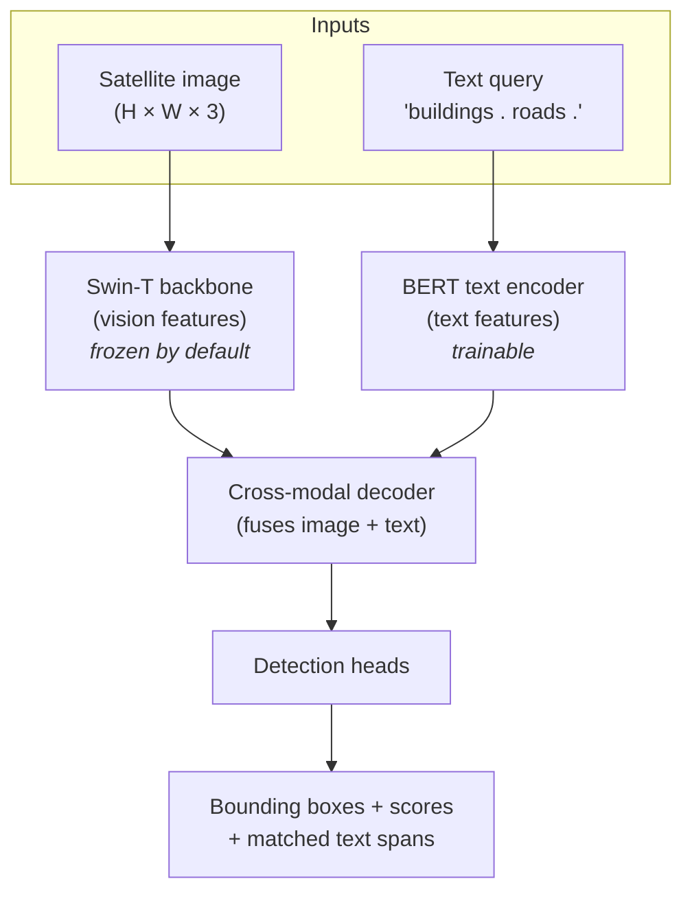
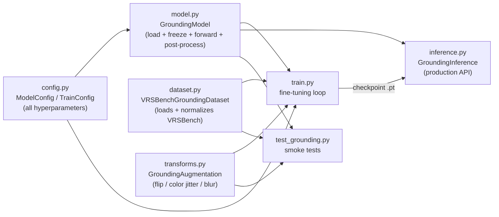
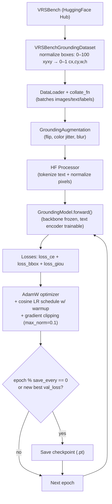
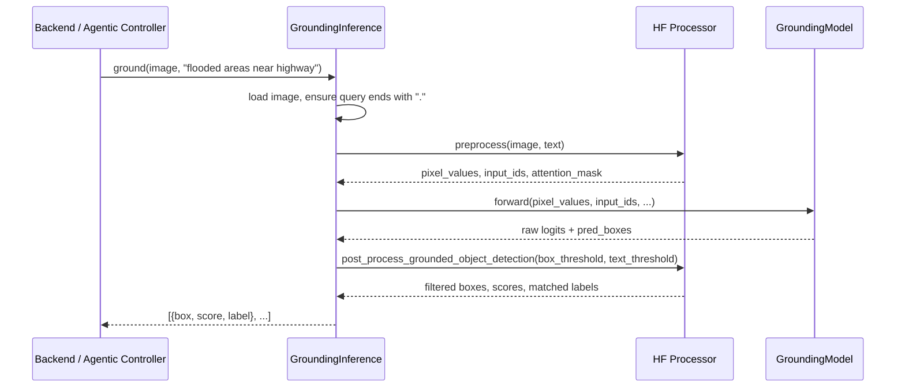
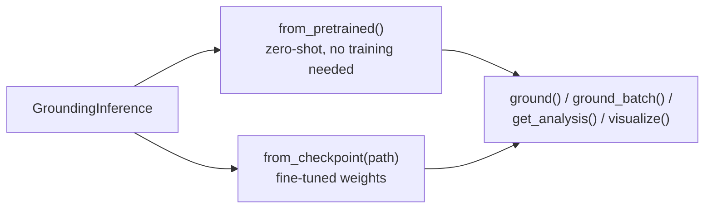

> Note: These diagrams use Mermaid code fences (` ```mermaid `). Obsidian renders these natively — no plugin needed, just paste this file in as-is.

# Text-Guided Region Grounding Module (`ml/grounding/`)

Given a satellite image + a plain-English phrase (e.g. *"water body near bridge"*), this module returns bounding boxes around the matching regions. It's built on **GroundingDINO**, an open-vocabulary detector — it isn't limited to a fixed list of classes, it can localize **anything describable in language**.

VRSBench dataset: **~52K object references over ~29K remote-sensing images**.

---

## 1. High-level architecture



---

## 2. Module map — what each file does



---

## 3. Training pipeline



---

## 4. Inference flow (what runs in production)



---

## 5. Loading paths



---

## Key numbers to remember

| Thing | Value |
|---|---|
| Base model | `IDEA-Research/grounding-dino-tiny` (~172M params) |
| Dataset | VRSBench — 52K object references / 29K images |
| Backbone frozen by default | Yes (Swin-T) |
| Text encoder frozen | No (BERT stays trainable) |
| Batch size | 4 |
| Epochs | 20 |
| LR | 1e-5 (backbone LR 1e-6 if unfrozen) |
| Gradient clip | max_norm = 0.1 |
| box_threshold / text_threshold | 0.25 / 0.25 |

## Talking points

- **Open-vocabulary, not fixed-class**: can ground phrases never seen during training (unlike classic object detectors with a hardcoded label set).
- **Backbone frozen** → cheaper fine-tuning, avoids catastrophic forgetting on a relatively small dataset.
- **Three joint losses** (`loss_ce`, `loss_bbox`, `loss_giou`) → is there an object, where exactly, how well does it overlap ground truth.
- **`get_analysis()`** is the exact dict shape the agentic controller consumes downstream.
- **`visualize()`** draws boxes directly on the image — usable for a live demo.
